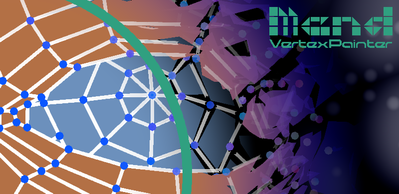

:author: Stanley Hailey
:nick: Lee
:email: zeroone@caffeine-machine.com
:editor: Mend Vertex Painter
:name: Mend
:version: v1.0
:experimental:
:srcdir: src/

== [big bold]#{SP}ReadMe#

{sp}

=== Description
*{editor}*, a simple, flexible Unity extension. Made for users needing to encode vertex color data or create stunningly artistic polygons within Unity.

=== Feature List
Features supported in *{name}* {version}.

* Display and edit vertex colors
* Paint in perspective or orthographic view
* Control brush size, strength and frequency
* Lock individual RGBA or HSBA channels
* Save edits to a file or make persistent edits directly to a mesh
* Brush functions include:
** Blend Color Value
** Add Color
** Subtract Color
** Random Color
** Average Vertex Colors
* Paint options include:
** Brushing front faces only
** Uniform brushing for single strokes

[cols="2,.^11a,.^10a,2", grid="none", frame="none"]
|===
|| .Screenshot 1

| .Screenshot 2
 |
|===

=== Basic Usage

* Access *{name}* from menu: +
*Window > {editor}*
* Select a mesh from the inspector or by clicking a game object twice.
* With valid mesh selected click *Paint* button to edit.
* Set brush controls preferred mesh save mode as needed.

[cols="2a,3a,3a,2a", grid="none", frame="none"]
|===
| >.>| .Menu location

| .Mend editor window
 |
|===

=== Hotkeys
Available hotkeys are visible in editor tooltips.
[cols=",3"]
|===
| Shortcut 				| Action

| kbd:[Alt+1]			| Toggle Paint on or off
| kbd:[Alt+2]			| Toggle display of vert color shader
| kbd:[Alt+3]			| Toggle backFace editing on or off
| kbd:[Alt+4]			| Toggle mode between buffering and saving
| kbd:[Alt+5]			| Save mesh when buffering
| kbd:[Shift+ScrollWheel]	| Resize paint brush
| kbd:[Alt+ScrollWheel]		| Rescale paint strength
|===

=== Todo
Below are a few features currently missing which may be implemented if given a compelling reason.

* Vertex layer masks
* Support for brushing face midpoints
* Support for brushing bone weights

=== Road Map

{name} is a foundation for whats to come.

* Currently developing a Suite of vertex color influenced procedural geometry modifiers inspired by Blender modifiers.
* Likely to come in toe with bundles and price drops.
* Enhancements and fixes.

=== Contact

For questions, comments please contact {author} ({nick}) by email. +
Email: {email} +
Support: https://github.com/Caffeine-Machine/MendVertexPainterDoc +
Website: http://caffeine-machine.com